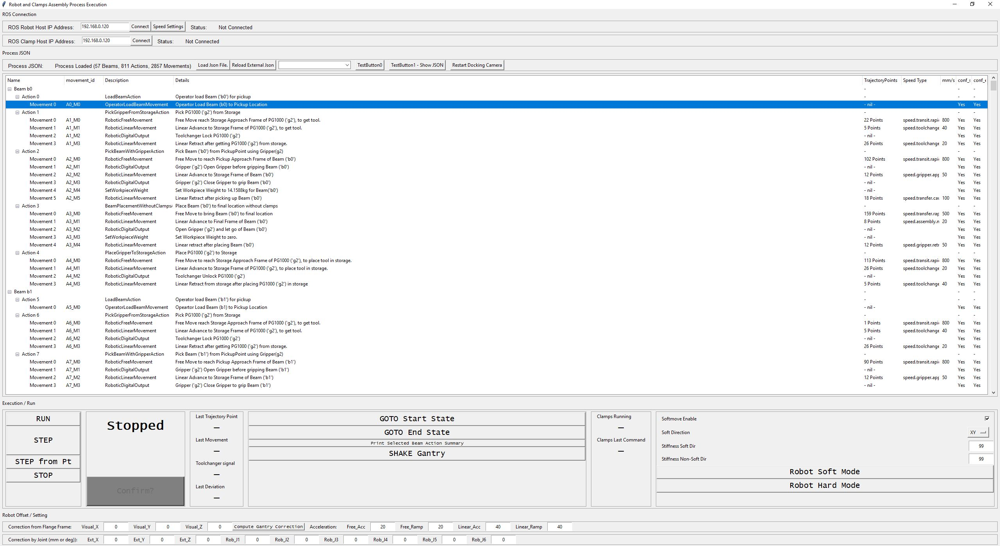

# itj_process_controller
Python-based high-level controller to coordinate robotic process for **Spatial Timber Assembly using Distributed Architectural Robots**. 

This repo is part of the [Robotic Assembled Timber Structures with Integral Timber Joints](https://github.com/gramaziokohler/integral_timber_joints) project.

## Repo folder structure

**/src/process_controller** - Contains the classes and **run.py** for starting the Process Controller


## Design Goals

This controller interprets the Actions and Movements in a specified Process file (as defined in `integral_timber_joints.process.RobotClampAssemblyProcess`).

It maintains a state machine that controls the sequential execution of the planned Movements. It communicates with a number of controllers and more can be added easily:

- ABB Robot Controller (compas_rrc_ros)
- Clamp Controller (`controller_instances` in [clamp_controller](https://github.com/gramaziokohler/clamp_controller) repository)
- Visual Docking  (`visual_docking` in [clamp_controller](https://github.com/gramaziokohler/clamp_controller) repository)

This controller maintains communication flow control with the ABB Robot controller for robotic movements with many TrajectoryPoints, as in planned trajectories.  It allows starting and stopping (from teach pendent or emergency stops) in a graceful manner. In case of stops or robot controller error (due to collision or other non-recoverable errors), it supports graceful restarts at a user defined trajectory point.

In normal operation, it can execute multiple Movements automatically in RUN mode (automatically moving execution pointer to next Movement) or STEP mode. The STEP mode is particularly useful during debugging.

This controller manages the execution speed of all movements. It allows easy setting and resetting of trajectory speed across all controllers. For synchronized movements, it can also ensures robot TP speed overrides are set correctly (which are often set to <100% during debugging). 

It maintains synchronization for RobotClampSyncMovements where the Robot Controller and Clamp Controller has to start and stop simultaneously. Such stop scenario can be triggered either by the robot controller, robot TP deadman switch, clamp firmware via Clamp Controller, Process Controller UI Stop button and Clamp Controller UI stop button.

It can perform sensor checks on the robot for movements such as Tool Changer Lock and Unlock. Although not implemented, automatic retry is possible when the lock is unsuccessful. 

The controller can work with Visual Docking ROS node for acquiring Aruco marker alignment. It can compute offset values for offsetting subsequent planned path. The offset values are applied to the Cartesian gantry. Offset values on each Joint can also be entered manually. 

The controller additionally implements a Gantry Shake feature to help when tool changer fail to lock when being picked up. It also provides UI for setting robot softness during soft moves for certain movements.   

## Installation

1. Clone the [this repository](https://github.com/gramaziokohler/clamp_controller).
2. Change directory `cd` to the local location of this repository.
3. Activate your virtual environment (optional).
4. Install the packages in the /src folder and the dependencies:

```
pip install -r requirements-dev.txt
```

## Network Setup

Multiple devices need to cooperate with each other during robotic execution. A number of networks are present to connect the devices to the control computer (which is my Laptop) running the Process Execution Controller. Below is a typical network configuration for the devices on the network.

**Laptop (Ethernet Port)** - connection to RFL ethernet network (192.168.0.0/24 subnet)

- Linux Virtual Machine running [ROS Master, ROS Bridge and ROS RRC_Driver](https://compas-rrc.github.io/compas_rrc/latest/reference/index.html) (192.168.0.117)
- ABB Robot Controller running RRC
- Routable Internet via ETH guest network

**Laptop (Wireless Adapter)** - connection to ESP32 camera network (192.168.1.0/24 subnet)

- 4 (or more) ESP32 cameras (192.168.1.100 to 192.168.1.103)

**Laptop (USB COM Port)** - connection to USB Radio Dongle (proprietary network)

- 4 Clamps (address 1-4)
- 4 Screwdrivers (address 5-8)

(there are alternative network setup possible, for example using USB-Ethernet Adapter for connecting to the Wireless AP)

(the ROS instances can also be run from my Laptop's VMware Workstation Ubuntu 16 Virtual Machine bridged to the RFL network)

## Usage

### Controller with front end user interface:

1. To start the controller UI. Change directory to where you want the log files to be placed.
2. Run one of the controller UI instance, for example:

```
cd local_directory_for_log_files
python -m process_controller.run
```

It is also possible to pass `-f` arg to specify the process file location to skip the file selection dialog. For example

```
python -m process_controller.run -f "C:\\Users\\leungp\\Documents\\GitHub\\integral_timber_joints\\external\\itj_design_study\\210419_HyparHut\\results\\Shelter_process.json"
```


UI like this should appear:




Credits
-------------

This repository was created by Pok Yin Victor Leung <leung@arch.ethz.ch> [@yck011522 ](https://github.com/yck011522) at [@gramaziokohler](https://github.com/gramaziokohler)

